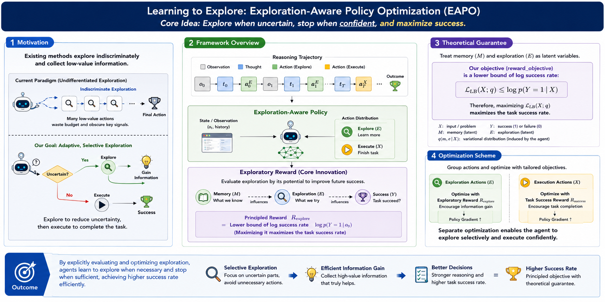

# Learning to Explore: Scaling Agentic Reasoning via Exploration-Aware Policy Optimization
<p align="center">
&nbsp&nbsp🌐 <a href="https://xingyuan-project.github.io/m2cl.github.io/">Website</a>&nbsp&nbsp | &nbsp&nbsp📑 <a href=https://arxiv.org/abs/2605.08978>arXiv</a>&nbsp&nbsp | &nbsp&nbsp🤖 <a href="https://huggingface.co/hansenhua/EAPO-ICML26">Model</a>&nbsp&nbsp | &nbsp&nbsp🤗 <a href="https://huggingface.co/hansenhua/EAPO-ICML26">Hugging Face</a>&nbsp&nbsp
</p>

<p align="center">
  
</p>

## 📢 Updates
<!-- - [2026-3-14] We publish the project page.
- [2026-2-5] We publish the paper on huggingface.
- [2026-2-4] We open-source the code for training.
- [2026-2-3] We publish the paper on arxiv. -->
- [2026-5-12] We publish the paper on arxiv
- [2026-5-11] We release the model on huggingface
- [2026-5-1] This paper was accepted by ICML'26

## 🔨 TODO
- [ ] Release the code.

## 🚀 Quick Start

This guide provides instructions for setting up the EAPO, including execution scripts for inference and training.

### 1. Preparation

#### Download Code

Download the code from Github.
```bash
git clone https://github.com/HansenHua/EAPO-ICML26.git
cd EAPO-ICML26
```

#### Prepare Model Checkpoints

Download the model using the HuggingFace CLI. Replace `<your local path>` with your actual directory.

```bash
huggingface-cli download model_path --local-dir <your local path>
```

### 2. Env Initialization

Initialize the python environment on your **GPU Machine**.

#### Install dependent packages

```bash
conda create -n your_env python=3.9
conda activate your-env
pip install -r requirements.txt
```

### 3. Execution

```bash
python main.py
```

## Performance
<p align="center">
  
</p>

## 📝 Citation
If you find our paper and code useful in your research, please consider giving a star ⭐ and citation 📝 :)

```bibtex
@inproceedings{
hua2026learning,
title={Learning to Explore: Scaling Agentic Reasoning via Exploration-Aware Policy Optimization},
author={Xingyuan Hua and Sheng Yue and Ju Ren},
booktitle={The Forty-third International Conference on Learning Representations},
year={2026}
}
```
